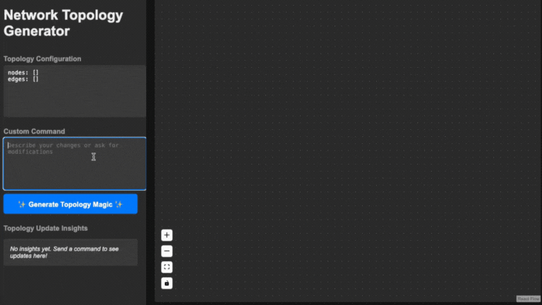

# Network Topology Generator

A web application that generates network topology diagrams based on user input, using OpenAI's GPT API to process natural language requests. Users can define nodes, their connections, and other configurations in a simple input box, and the app will render the diagram and display the configuration details in YAML format.

## Demo

  
*Example of using the Network Topology Generator.*

## Features

- Create and visualize network topology diagrams by describing nodes and connections in natural language.
- Automatically generates YAML configurations based on user input.
- Allows users to customize network components interactively on a diagram.

## Requirements

- **Node.js** (v14 or higher)
- **npm** (comes with Node.js) or **yarn**
- **OpenAI API Key**: Required to use GPT API (sign up at [OpenAI](https://openai.com/) to get an API key).
- **react-flow-renderer**: For rendering the network topology graph in the frontend.

## Installation

1. Clone the repository:
```bash
git clone https://github.com/yourusername/network-topology-generator.git
cd network-topology-generator
```

2. Install dependencies for both the frontend and backend:
```bash
# Install frontend dependencies
cd network-topology-app
npm install
```

3. Install backend dependencies:
```bash
cd ../network-topology-backend
npm install
```

4. Set up the OpenAI API key:

In network-topology-backend, create a .env file:
```bash
touch .env
```

Add your OpenAI API key in .env:
```
OPENAI_API_KEY=your_openai_api_key_here
```

## Running the Project Locally

1. Start the backend server:

```bash
cd network-topology-backend
node server.js
```

2. Start the frontend server:

```bash
cd ../network-topology-app
npm start
```

Open your browser and navigate to http://localhost:3000 to start using the application.


## License

This project is licensed under the MIT License.


